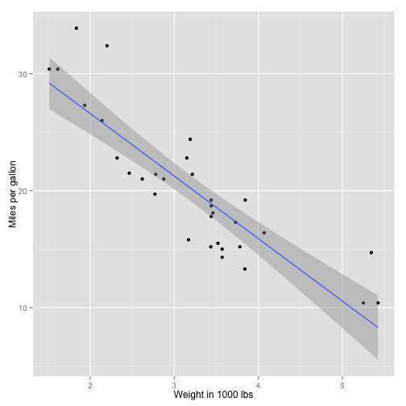

Course Project of Developing Data Products
========================================================
author: Attila Toth
date: 27 Dec 2015

Project Objectives
========================================================

In the framework of this course the peer project consists
of an individual Shiny application. The outcome should
meet the following criteria:

- Intuitive UI (easy to use)
- Deployed to RStudio's Shiny server
- Forms for user input/interactions
- Create a UI that generates some input for server.R
- Reactive output(s)

Data
========================================================

For this task I used a widely known, easy dataset that
comes along with every R distribution, the so-called
**mtcars**.


```r
str(mtcars)
```

```
'data.frame':	32 obs. of  11 variables:
 $ mpg : num  21 21 22.8 21.4 18.7 18.1 14.3 24.4 22.8 19.2 ...
 $ cyl : num  6 6 4 6 8 6 8 4 4 6 ...
 $ disp: num  160 160 108 258 360 ...
 $ hp  : num  110 110 93 110 175 105 245 62 95 123 ...
 $ drat: num  3.9 3.9 3.85 3.08 3.15 2.76 3.21 3.69 3.92 3.92 ...
 $ wt  : num  2.62 2.88 2.32 3.21 3.44 ...
 $ qsec: num  16.5 17 18.6 19.4 17 ...
 $ vs  : num  0 0 1 1 0 1 0 1 1 1 ...
 $ am  : num  1 1 1 0 0 0 0 0 0 0 ...
 $ gear: num  4 4 4 3 3 3 3 4 4 4 ...
 $ carb: num  4 4 1 1 2 1 4 2 2 4 ...
```

Application Overview - Simple Browsing
========================================================

My application aims to help users in discovering this 
particular dataset. Users can interactively explore what
data are collected and stored about each models. This is
provided through a dynamic table controlled by a dropdrown list.

 

Application Overview - Plotting Variables
========================================================
`mtcars` was collected to examine Miles Per Gallon 
performance for each car model. With this part of the 
application, users can discover main factors (variables) 
that actually drive this attribute of cars. The application 
lets users to visualize the relationship between 'mpg' 
(Miles Per Gallon) and an arbitrary attributes.

A simple example:


